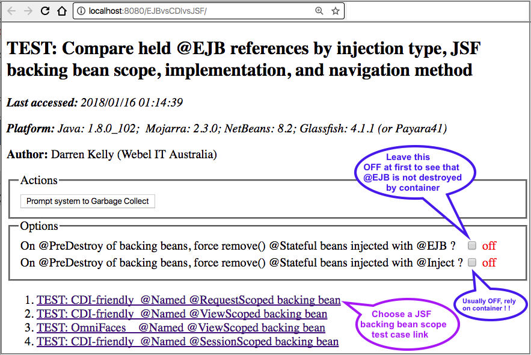
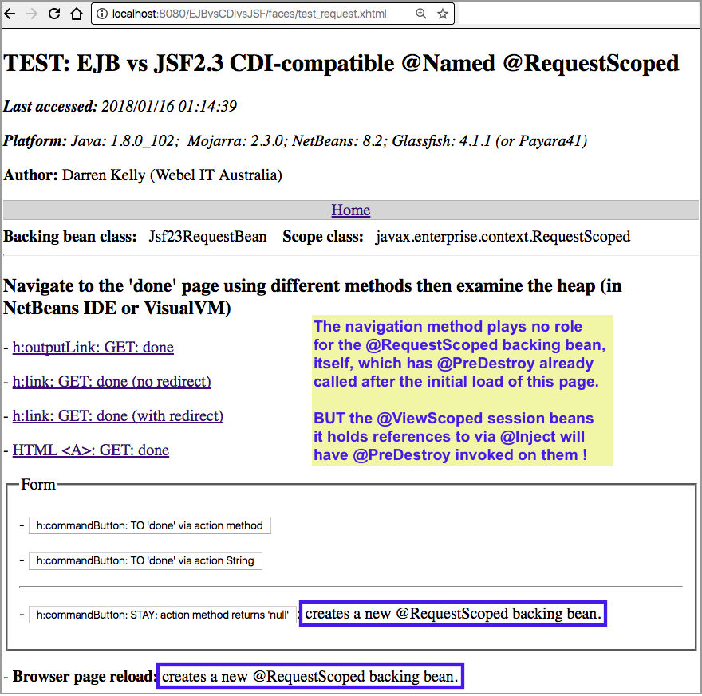
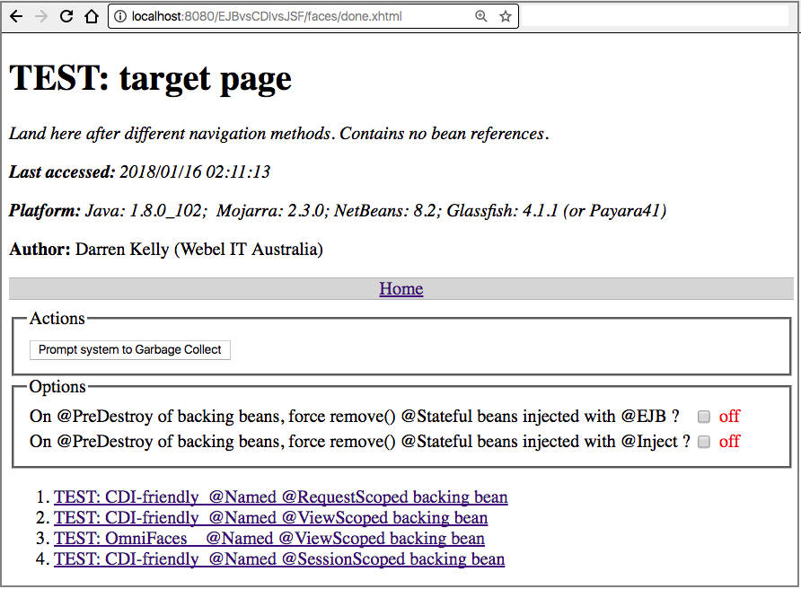
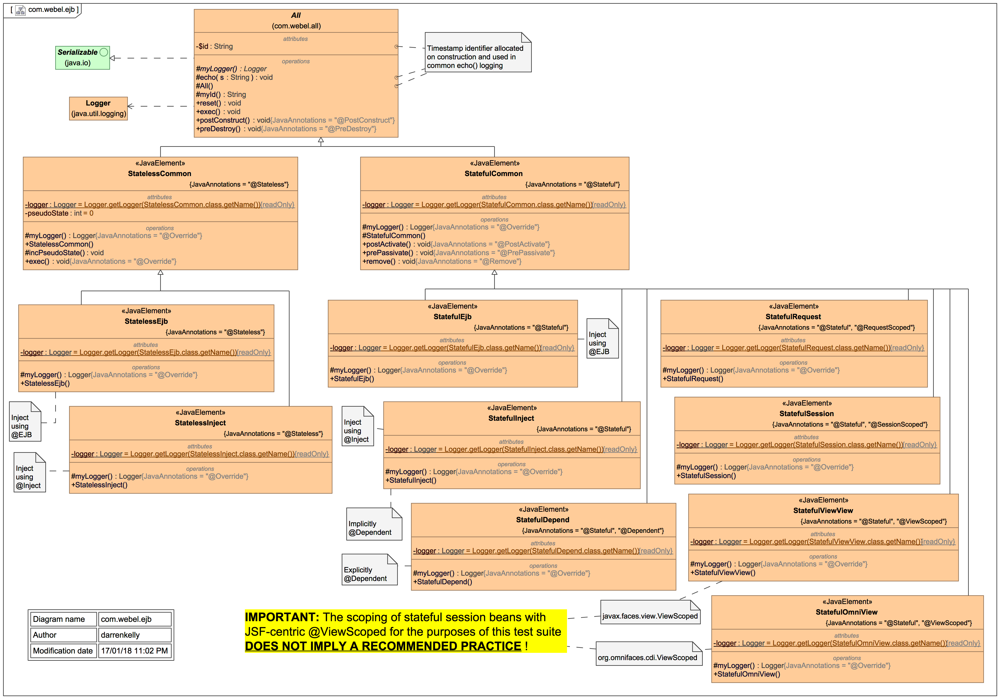
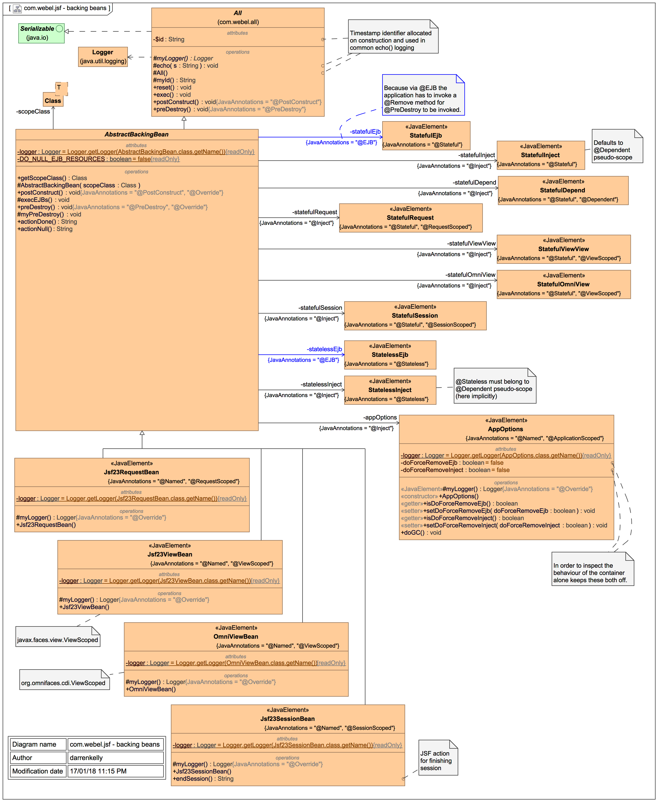
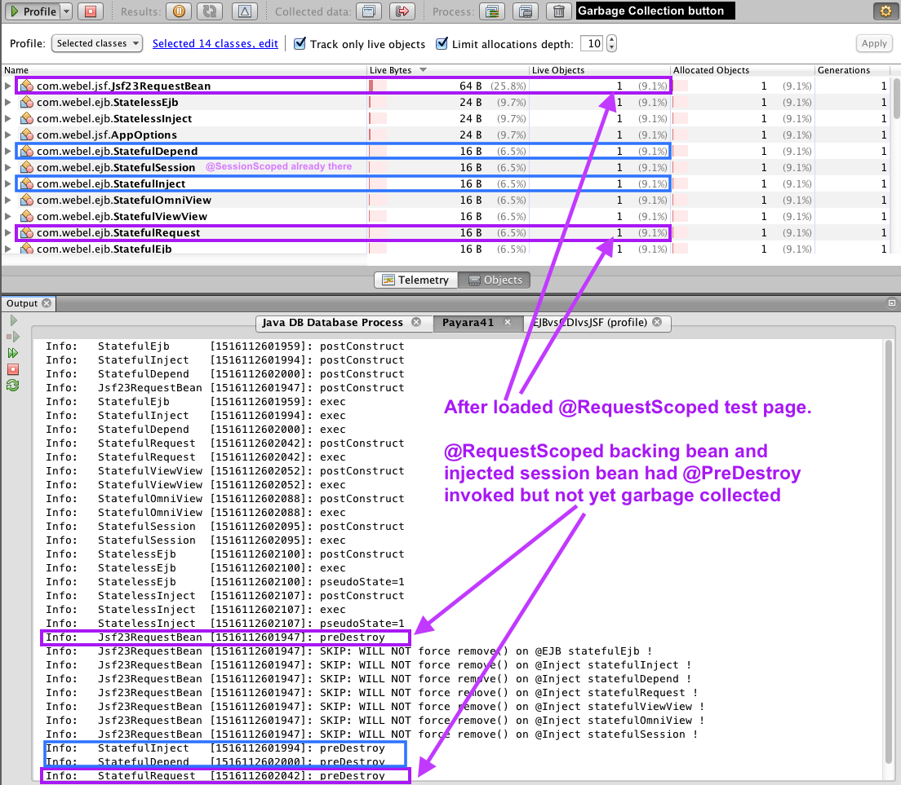
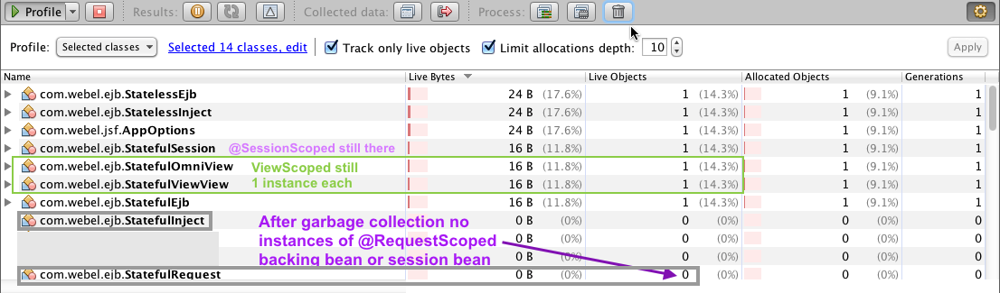
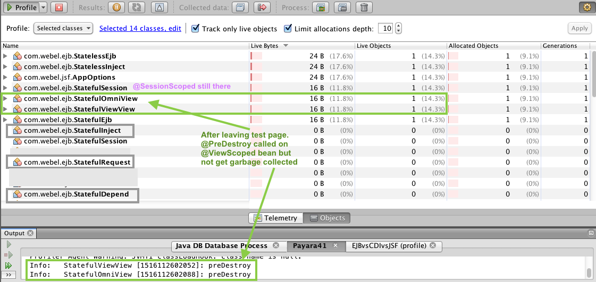
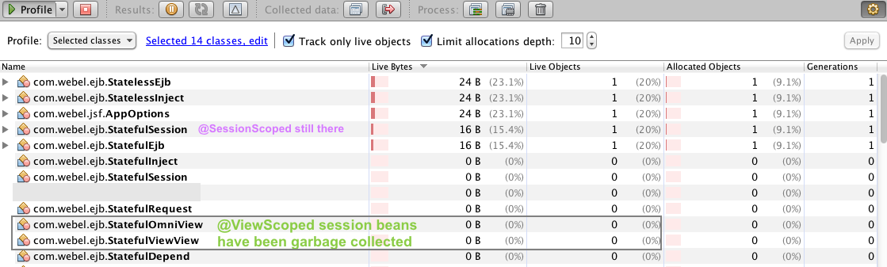

## Investigation of lifecycle of EJBs under various forms of injection into JSF backing beans of various CDI scopes, with a focus on @ViewScoped beans by navigation type

*Author: Darren Kelly ([Webel IT Australia](https://www.webel.com.au)).* *Thanks to [GreenSoft](https://www.greensoftaustralia.com) for sponsoring development of this test web app.*

This **NetBeans IDE** mini test web app is for investigation of the lifecycle of `@Stateless` and `@Stateful`  Enterprise Java session beans under injection using `@EJB` vs CDI `@Inject` into `@Named` JavaServer Faces (JSF) "backing beans" of various CDI-compatible scopes.

The EJB session bean lifecycle callbacks `@PostConstruct` and `@PreDestroy` -  and additionally also  `@PostActivate` and `@PrePassivate` for `@Stateful` session beans - are logged for analysis.

This mini test web app also investigates when or whether `@PreDestroy` methods are called and whether garbage collection succeeds for various forms of  backing beans (`@RequestScoped`,  `@ViewScoped`, and `@SessionScoped`), which concern is inextricably linked with the lifecycle of any session beans injected into the backing beans, and how they are injected (via `@EJB` or via CDI `@Inject`).

*(See also this older JSF-only test project https://github.com/webelcomau/JSFviewScopedNav, which was spawned and extended here to also include examination of the lifecycle of EJB session beans under @Inject vs @EJB.)*

This **NetBeans IDE 8.2** project may be deployed to the bundled GlassFish 4.1.1 web app server
(or to an additionally installed Payara41 web app server, or newer GlassFish). Download from:

- http://www.netbeans.org (required)
- http://www.payara.fish (optional)
- Also runs with [the latest GlassFish5](https://javaee.github.io/glassfish/download) (although the NetBeans 8.2 Profiler seems to struggle with it).

You may set your own web application server under `Properties > Run`.

### Background to @CDI vs @Inject for session beans

Keep the following from [CDI-2.0 (JSR-365)](http://docs.jboss.org/cdi/spec/2.0/cdi-spec.html#_relationship_to_the_java_ee_platform_specification) in mind at all times (my <u>underlining</u>):

> 'EJB components may be stateful, but are not by nature contextual. References to stateful component instances must be explicitly passed between clients and <u>stateful instances must be explicitly destroyed by the application</u>.
>
> This specification enhances the EJB component model with contextual lifecycle management.
>
> Any session bean instance obtained via the dependency injection service is a contextual instance. It is bound to a lifecycle context and is available to other objects that execute in that context. The container automatically creates the instance when it is needed by a client. <u>When the context ends, the container automatically destroys the instance</u>.'

Amongst other things, this test suite is designed to illustrate exactly what this means when working with `@Stateful` session beans, and what the implications of declaring explicit scope for session beans is, and how they behave differently under injection into a backing bean using `@EJB` vs `@Inject`.

Also, from the [JBoss CDI User Guide](https://docs.jboss.org/cdi/learn/userguide/CDI-user-guide.html#_session_beans):

> 'There’s no reason to explicitly declare the scope of a stateless session bean or singleton session bean. […] On the other hand, <u>a stateful session bean may have any scope</u>.
>
> Stateful session beans may define a remove method, annotated @Remove, that is used by the application to indicate that an instance should be destroyed. However, for a contextual instance of the bean — an instance under the control of CDI — this method may only be called by the application if the bean has scope @Dependent. For beans with other scopes, the application must let the container destroy the bean.'

The test web app includes some switches to force invocation of `remove()` on stateful session beans whenever the backing bean into which they were injected has its `@PreDestroy` method invoked (see section below on options). By default these should be OFF so you can see the intended behaviour of the container.


#### THE WELD IMPLEMENTATION VERSION

The WELD CDI implementation version will depend initially on your GlassFish (or Payara install):

- GlassFish-4.1.1 has WELD 2.2.13.Final **[CDI 1.2]**
- GlassFish-5 has WELD 3.0.0 (Final) **[CDI 2.0]**
- Payara41 (Payara 163 Full) has WELD 2.3.5 (Final)

(Unfortunately, upgrading to latest in WELD in GlassFish-4.1.1 is tricky because of recent dependencies, just install GlassFish5 instead within your NetBeans install, and choose it under Project > Run, it's very easy.)


#### MOJARRA JSF IMPLEMENTATION VERSION

Currently the web app is for demonstration against the Mojarra 2.x JSF implementation series.
Use the JSF Mojarra version bundled with NetBeans8.2/Glassfish4.1.1 or install a recent version:

- Use Maven or download javax.faces.jar directly from:

  Releases: https://maven.java.net/content/repositories/releases/org/glassfish/javax.faces/

  Snapshots: https://maven.java.net/content/repositories/snapshots/org/glassfish/javax.faces/

To install by hand, stop your web app server and copy the Mojarra JAR to:

`.../NetBeans-8.2/glassfish-4.1.1/glassfish/modules/javax.faces.jar`

`.../NetBeans-8.2/payara41/glassfish/modules/javax.faces.jar`

Then restart your server:

- The test web app interrogates the Mojarra version live and displays it in the header of each web page.
  ​


#### JAVA VERSION

For use with Java7 or Java8:

- The test web app interrogates the Java version and displays it in the header of each web page.


#### DIAGNOSTIC TOOLS

You will need a tool for diagnosing memory use and references to instances of JSF beans:

- You can use the Profiler within NetBeans IDE.

- **PLEASE DO NOT use JVisualVM !** It gives incorrect results. When attached to GlassFish/Payara
  it gives references still held (even after `@PreDestroy` is called) by a field `sessionListeners` of type 
  `com.sun.web.server.WebContainerListener` within `ContainerBase$ContainerBackgroundProcessor`, and they won't garbage-collect, corrupting the results !  Visit also (another time) [this forum posting](https://stackoverflow.com/questions/40569971/jsf-mojarra-vs-omnifaces-viewscoped-predestroy-called-but-bean-cant-be-gar).


#### ON SESSION TIMEOUT

Some callbacks are only invoked automatically when the session expires, which may sometimes occur due session time-out (see `WEB/web.xml` to set the timeout value in minutes):

    <session-config>
      <session-timeout>
            30
      </session-timeout>
    </session-config>
- You can set this to a very small number like `1` (means 1 minute) to see what happens when a session ends by natural expiration. 
- On the test page for a `@SessionScoped` backing bean there is also a special button for forcing a JSF session to end.


#### ON USE OF OMNIFACES VIEW SCOPE

This test web app includes also a comparison of CDI-compatible JSF view scope with the 3rd-party OmniFaces JSF toolkit view scope:

- A current/recent OmniFaces library is included with the project under `./lib`

- Please visit and read also: http://showcase.omnifaces.org/cdi/ViewScoped

  ​


#### ON USE OF JSF VIEW SCOPE CONTEXT PARAMETERS

In web.xml the application is set to use:

    com.sun.faces.numberOfViewsInSession 4

    com.sun.faces.numberOfLogicalViews 4
By default this OmniFaces-specific parameter is commented out:

    org.omnifaces.VIEW_SCOPE_MANAGER_MAX_ACTIVE_VIEW_SCOPES
The `javax.faces.STATE_SAVING_METHOD` defaults to 'server'.


#### **HOWTO RUN AND USE THE TEST WEB APP**

**STEP 0:** Download it using the green Clone or download button (top right), select Download  (there is no need to clone it) then unzip it.


**STEP 1: Open the project in NetBeans IDE** and check the Project Properties:

- Under Libraries set the Java Platform to JDK1.8 (if available), otherwise JDK1.7.

- Under Run set the server to Glassfish4.1.1 (or Payara41 or GlassFish5 if installed).

The choice of server may also affect the JSF Mojarra version and WELD CDI version (see above).

The folder `./nbproject/private` is NOT distributed with the test web app, so these settings are local.


##### **STEP 2: Clean and build.**


##### **STEP 3: Run in basic mode (and explore the server log output for different test page cases)**

The home page gives you links to different backing bean cases (where each backing bean type holds
references to a nearly identical set of session beans of various scoped injected in various ways):





Try the `@RequestScoped` backing bean case first:




When you navigate away you'll end up at a target page, from which you can continue tests via the links to the test pages or perform actions and/or select options:



The main exercise is to watch the server logs for lifecycle callback events, we'll inspect those in detail below.


##### **STEP4: Run in NetBeans Profiler mode:**

Use the built-in NetBeans Profiler, **Please DO NOT use JVisualVM** !

- DO NOT use the usual Run button, use instead Profile (right click context menu on Project node).

This will run the project in profiling mode (and usually restarts the web app server too).

- Under the Profile toolbar button use the pulldown (small down array right of Profile button)
  to choose Enable Multiple Modes then Telemetry (gives an overview) and Objects.
- Click the settings gear wheel icon (top right).
  - Choose to **Profile Selected Classes**, then select these classes:
    - `com.webel.jsf.Jsf23RequestBean` `com.webel.jsf.Jsf23ViewBean` `com.webel.jsf.OmniViewBean` `com.webel.jsf.Jsf23SessionBean`
    - `com.webel.ejb.StatefulEjb` `com.webel.ejb.StatefulInject` `com.webel.ejb.StatefulDepend` `com.webel.ejb.StatefulRequest` `com.webel.ejb.StatefulViewView` `com.webel.ejb.StatefulOmniView` `com.webel.ejb.StatefulSession`
    - `com.webel.ejb.StatelessEjb` `com.webel.ejb.StatelessInject`
  - Instances for them won't be shown in the Profiler until you choose and load a matching test page.


- Note how there is also a rubbish-bin (trash-can) icon/button for invoking Garbage Collection.


*Below there is a sequence of typical profiler screenshots, but to understand them, you'll need first to briefly inspect the different kinds of backing beans and the types of sessions beans that are injected into them.*


#### QUICKSTART: Understanding the different EJB session beans

The following different types of EJB session beans are investigated, named to indicate the scope and how they should be injected (for the purposes of this comparative test suite):

----

```java
// A stateful EJB without explicit scope; 
// Inject this into a backing bean using @EJB.`
@Stateful
public class StatefulEjb extends StatefulCommon {
```

---

```java
// A stateful EJB without explicit scope; 
// Inject this into a backing bean using @Inject.
@Stateful
public class StatefulInject extends StatefulCommon {
```

----
```java
import javax.enterprise.context.Dependent;
// A stateful EJB with explicit dependent pseudo-scope; 
// Inject this into a backing bean using @Inject.
@Stateful
@Dependent
public class StatefulDepend extends StatefulCommon {
```

----
```java
import javax.enterprise.context.RequestScoped;
// A stateful EJB with explicit request scope; 
// Inject this into a backing bean using @Inject.
@Stateful
@RequestScoped
public class StatefulRequest extends StatefulCommon {
```

----
```java
import javax.faces.view.ViewScoped;
// A stateful EJB with explicit CDI-compatible view scope; 
// Inject this into a backing bean using @Inject.
//
// This is for testing purposes only; it is not suggested here that using view scope
// with a stateful session bean is recommended (even though it still appears to work).
@Stateful
@ViewScoped
public class StatefulViewView extends StatefulCommon {
```

----
```java
import org.omnifaces.cdi.ViewScoped;
// A stateful EJB with explicit OmniFaces view scope; 
// Inject this into a backing bean using @Inject.
//
// This is for testing purposes only; it is not suggested here that using view scope
// with a stateful session bean is recommended (even though it still appears to work). 
@Stateful
@ViewScoped
public class StatefulOmniView extends StatefulCommon {
```

----
```java
import javax.enterprise.context.SessionScoped;
// A stateful EJB with explicit session scope; 
// Inject this into a backing bean using @Inject.
@Stateful
@SessionScoped
public class StatefulSession extends StatefulCommon {
```

----

```java
// A stateless EJB (without explicit scope); 
// Inject this into a backing bean using @EJB.
@Stateless
public class StatelessEjb extends StatelessCommon {
```

----

```java
// A stateless EJB (without explicit scope); 
// Inject this into a backing bean using @Inject.
@Stateless
public class StatelessInject extends StatelessCommon {
```

----

**IMPORTANT:** The scoping of stateful session beans with JSF-centric `@ViewScoped` for the purposes of this test suite **<u>DOES NOT IMPLY A RECOMMENDED PRACTICE</u>** !

---

##### UML class diagram of session beans:



---

These are injected into the JSF backing beans thus, shared via a common base class `AbstractBackingBean`:

```java
@EJB //! For this test
private StatefulEjb statefulEjb;

@Inject
private StatefulInject statefulInject;

@Inject
private StatefulDepend statefulDepend;

@Inject
private StatefulRequest statefulRequest;

@Inject
private StatefulViewView statefulViewView;

@Inject
private StatefulOmniView statefulOmniView;

@Inject
private StatefulSession statefulSession;


@EJB //! For this test
private StatelessEjb statelessEjb;

@Inject
private StatelessInject statelessInject;
```

The `exec()` method of each session bean is also invoked on `@PostConstruct` of each backing bean.

You may have noticed that the types of session bean tested are not (yet) complete w.r.t. the 6 built-in scopes:

* The ` @ApplicationScoped` has been excluded because creation of beans with these scopes on application startup complicates the analysis in the Profiler a bit.
* `@ConversationScoped` has been excluded because it would require demonstration of `begin()` and `start()`, which can't be easily done for all backing bean cases. 
* Also, the `@Singleton` pseudo-scope is not yet covered.
* `@TransactionScoped` was [introduced in JavaEE7](https://docs.oracle.com/javaee/7/api/javax/transaction/TransactionScoped.html); transactions aren't explored in this test app yet.
* `@FlowScoped` was also [introduced in JavaEE7](https://docs.oracle.com/javaee/7/api/javax/faces/flow/FlowScoped.html); using it for a session bean might make sense within  a `@FlowScoped` backing bean (not demonstrated here yet).
  ​

#### QUICKSTART: Understanding typical output: CASE: @RequestScoped

The following shows typical server log output for a request-scoped backing bean. (In this case, unlike with view-scoped, there is no need to navigate away from the page to see the backing bean destruction.)

http://localhost:8080/EJBvsCDIvsJSF/faces/test_request.xhtml

```
Info:   StatefulEjb      [1516008751003]: postConstruct
Info:   StatefulInject   [1516008751005]: postConstruct
Info:   StatefulDepend   [1516008751006]: postConstruct
Info:   Jsf23RequestBean [1516008751003]: postConstruct
Info:   StatefulEjb      [1516008751003]: exec
Info:   StatefulInject   [1516008751005]: exec
Info:   StatefulDepend   [1516008751006]: exec
Info:   StatefulRequest  [1516008751009]: postConstruct
Info:   StatefulRequest  [1516008751009]: exec
Info:   StatefulViewView [1516008751011]: postConstruct
Info:   StatefulViewView [1516008751011]: exec
Info:   StatefulOmniView [1516008751014]: postConstruct
Info:   StatefulOmniView [1516008751014]: exec
Info:   StatefulSession  [1516008112530]: exec
Info:   StatelessEjb     [1516008112536]: exec
Info:   StatelessEjb     [1516008112536]: pseudoState=11 [Shows has been invoked many times via pool]
Info:   StatelessInject  [1516008112539]: exec
Info:   StatelessInject  [1516008112539]: pseudoState=11 [Shows has been invoked many times via pool]
Info:   Jsf23RequestBean [1516008751003]: preDestroy
Info:   Jsf23RequestBean [1516008751003]: SKIP: DO NOT force remove() on @EJB statefulEjb !
Info:   Jsf23RequestBean [1516008751003]: SKIP: DO NOT force remove() on @Inject statefulInject !
Info:   Jsf23RequestBean [1516008751003]: SKIP: DO NOT force remove() on @Inject statefulDepend !
Info:   Jsf23RequestBean [1516008751003]: SKIP: DO NOT force remove() on @Inject statefulRequest !
Info:   Jsf23RequestBean [1516008751003]: SKIP: DO NOT force remove() on @Inject statefulViewView !
Info:   Jsf23RequestBean [1516008751003]: SKIP: DO NOT force remove() on @Inject statefulOmniView !
Info:   Jsf23RequestBean [1516008751003]: SKIP: DO NOT force remove() on @Inject statefulSession !
Info:   StatefulInject   [1516008751005]: preDestroy
Info:   StatefulDepend   [1516008751006]: preDestroy
Info:   StatefulRequest  [1516008751009]: preDestroy
```

Note that:

- Each bean has an identifier, which is the `Date.time()` milliseconds at the moment of construction; this approach makes it very easy to track each bean and see whether and when it is destroyed (and is independent of proxies).
- On construction of a backing bean, exec() is invoked on every injected EJB.
- Stateless EJBs have a `pseudoState`, the number of times `exec()` was invoked, which enables one to see whether the same stateless bean is being offered back via the pool on separate invocations.
- You can choose whether to explicitly invoke `remove()` on stateful session beans injected via `@EJB` and/or on stateful session beans injected via `@Inject`. The logged info makes it clear that this has been SKIPPED and NOT done here. (See also section below about option switches.)

In the particular run above:

- The @PostConstruct was not invoked on the `@Stateless` session beans, presumably because they were already created earlier (during a separate page load) and are merely being served back from the pool.
- Likewise, @PostConstruct was not invoked on the `@SessionScoped ` `@Stateless` session bean, which it seems was already created earlier during the test run session.
- The @PreDestroy was automatically invoked on those `@Stateful` session beans <u>that were injected using `@Inject`</u> AND have lower or matching scope w.r.t. `@RequestScoped`, **but was NOT invoked (yet) for the @Stateful EJB <u>that was injected using @EJB</u>**.
- The @PreDestroy was also not invoked (yet) for those `@Stateful` session beans that were injected using `@Inject` but had the higher scopes `@ViewScoped`, `@SessionScoped`.


#### DIAGNOSING EJB RELEASE BY JSF BEAN SCOPE AND/OR IMPLEMENTATION

The initial web page is an index to 4 test cases, one for each of the JSF backing bean forms below:

----

```java
import javax.inject.Named;
import javax.enterprise.context.RequestScoped; // CDI-compatible version
@Named
@RequestScoped
public class Jsf23RequestBean extends AbstractViewBean {
```

----

```java
import javax.inject.Named;
import javax.faces.view.ViewScoped; // CDI-compatible JSF2.3 version
@Named
@ViewScoped
public class Jsf23ViewBean extends AbstractViewBean {
```

----


```java
import javax.inject.Named;
import org.omnifaces.cdi.ViewScoped; // 3rd party CDI-compatible
@Named
@ViewScoped
public class OmniViewBean extends AbstractViewBean {
```

----

```java
import javax.inject.Named;
import javax.enterprise.context.SessionScoped; // CDI-compatible version
@Named
@SessionScoped
public class Jsf23SessionBean extends AbstractViewBean {
```

----

##### UML class diagram of JSF backing beans:



---

You may have noticed that the range of backing bean scopes tested is not (yet) complete:

- The ` @ApplicationScoped` has been excluded deliberately, because it would cause many injected session beans to be created at application startup, which complicates the analysis during profiling. (There is a an `AppOptions` backing bean with `@ApplicationScoped`, however it does not have any injected session beans.)
- The `@FlowScoped` has been excluded because it would require inclusion of a flow, which is more complicated than the purpose of the current  test cases, with their focus on the lifetime of injected session beans.
- The `@Dependent` scope is also not used yet for the backing bean test pages (it would have to be itself injected into something); that might however make a nice test for the future.

The focus of this test app is mostly on `@ViewScoped`. It is ironic that - given that [@ViewScoped](https://docs.oracle.com/javaee/7/api/javax/faces/view/ViewScoped.html) is (with its excellent support for AJAX) perhaps the most-used scope in the JSF community - 'view scope' is only  mentioned once "in passing" in the latest JavaEE8 tutorial version (under [Using Managed Bean Scopes](https://javaee.github.io/tutorial/jsf-configure002.html#GIRCR)) !

> If you are configuring a bean that allows attributes to be associated with the view, you can use the view scope. The attributes persist until the user has navigated to the next view.

---

Each test page creates (usually) a new backing bean when first loaded. Of interest is what happens to the backing beans **and their referenced session beans** on initial page load, and once the page is left or reloaded (whereby the result depends on the backing bean type and navigation method used).

- Concern1: Is @PreDestroy invoked on the backing bean so there is an opportunity to clean up resources ?
- Concern2: Can the backing bean itself be garbage collected ?
  - Concern2a: Can the backing bean be immediately garbage collected ?
  - Concern2b: Can the backing  bean be garbage collected later 
    (such as when the logical number of view is hit, or the session ends) ?
- **Concern3: Is @PreDestroy invoked on the injected EJBs (session beans) ?**
  - Concern3a: Can  the session beans be immediately garbage collected ?
  - Concern3b: Can the session beans be garbage collected later ?
  - <u>Concern3c: Does remove() have to be explicitly invoked on any of the injected EJBs ?</u>
- <u>Concern4: Does it make a difference whether @Inject or @EJB is used ?</u>
- <u>Concern5: Does it make a difference what explicit scope (if any) a @Stateful EJB has ?</u>


**IMPORTANT:** The test web app here is primarily for use with immediate garbage collection forced via the Profiler, and while it can be used to investigate later garbage collection (such as after session time-out) the published test results don't address that aspect.

**IMPORTANT:** in order to observe when and/or whether `@PreDestroy` methods are invoked and whether a backing bean and any injected EJBs are garbage collected you will need a systematic approach:

1. Use the Perform GC function in your profiler BEFORE loading each test page.

2. Invocations of `@PostConstruct` and `@PreDestroy` methods are logged to the server console.
   Use the NetBeans server log console window, and clear it BEFORE loading each test page
   and AFTER navigating away from each test page (but not before first noting the output).

3. Use the Perform GC function in your profile AFTER navigating away from each test page.

You must be vigilant and watch carefully the number of instances of each bean type
in your profiler at each stage.


#### QUICKSTART: A quick tour through the NetBeans Profiler Objects view

After loading the `@RequestScoped` test page, 1 backing bean instance (class `Jsf23RequestBean`) and various injected session bean instances have been created. The `@PreDestroy` has already been called on the `@RequestScoped` backing bean and ` @RequestScoped` stateful session bean, but they have not yet been garbage collected. The server output window at the bottom shows the logged lifecycle callback events:




After a garbage collection action, the `@RequestScoped` backing bean and `@RequestScoped` stateful session bean instance have been removed from the heap. The `@Dependent` beans have also been garbage collected:




After moving away from the test page to the target (`done.xhtml`) page. The `@ViewScoped` session beans have had `@PreDestroy` invoked (as indicated but the server log), but have not yet been garbage collected:




After a 2nd garbage collection action. The `@ViewScoped` session beans have now been garbage collected:



The contextual `@SessionScoped` session bean (that was injected with CDI `@Inject`) is still there. And the `@Stateless` session beans are both still there because they have been pooled. 

As expected, the <u>non-contextual</u> `@Stateful` session bean that was injected with `@EJB` is also still there, because no `remove()` was explicitly invoked on it by the application (yet).


#### ABOUT THE BACKING BEAN TEST PAGES AND NAVIGATION CASES IN MORE DETAIL

*Although the aim of this test app is to investigate **when and whether injected session beans are released**, this is ultimately dictated by the scope of the backing beans into which the session beans are injected, and for scopes such as @ViewScoped, how one navigated away from the test pages (the "view").*

Each backing bean test web page has (hopefully) clear instructions.

Each test page (for each different backing bean type) offers the same
selection of navigation cases for leaving the scoped page and landing at
a target page `done.xhtml` (which page does not use any scoped backing beans).

Access a desired test page initially from the top-level index page (Home),
which page likewise does not use or create any scoped backing beans.

There are 3 basic subsets of navigation cases:

1. GET related navigation cases (no form): `h:link`, `h:outputLink`, and HTML <a>

   (Please ignore the distinction between links with and without redirects,
    that is for investigating something unrelated to the main concerns.)

2. Form based navigation cases: 

   - `h:commandButton` with `action` String and `h:commandButton` with action method return String.

   - A special case is remaining on the same view scoped page using 'null' navigation.

3. Web browser's page reload action.

(An additional special case, not included in the results table, is a GET on the web browser URL,
which case might be used during facelets development, but is not usually used by novice users.)


After navigating away from a backing-bean test page to the target page you may:

- Navigate back to the previous scoped backing bean test page (or another).
- Navigate back to the top-level home page (index.html).
- Perform a Garbage Collection prompt action (not guaranteed to actually force GC)
- Set an application-wide option/switch (see below).

Again: be aware of diagnostics in both your profiler and server log window at all times.


### SUMMARY OF TYPICAL RESULTS

See the `/results` folder for some simple annotated text files that show some results for typical backing bean cases, and for each of the session bean types, under `@Inject` and `@EJB`.

The following also shows a typical sequence of results with some comments about how to interpret the server log output.

On running the test web app the `@ApplicationScoped` backing bean of class `AppOptions` is constructed:

```
Info:   Initializing Mojarra 2.3.0 ( 20170310-1214 ..) for context '/EJBvsCDIvsJSF'
Info:   Loading application [EJBvsCDIvsJSF] at [/EJBvsCDIvsJSF]
...
Info:   AppOptions       [1516008033790]: postConstruct
```


#### *The first test we'll try is for a `@RequestScoped` backing bean, which can be accessed from a link on the home page:*

http://localhost:8080/EJBvsCDIvsJSF/faces/test_request.xhtml

**Backing bean class:** Jsf23RequestBean, **Scope class:** javax.enterprise.context.RequestScoped

```
Info:   StatefulEjb      [1516008112395]: postConstruct
Info:   StatefulInject   [1516008112427]: postConstruct
Info:   StatefulDepend   [1516008112433]: postConstruct
Info:   Jsf23RequestBean [1516008112388]: postConstruct
Info:   StatefulEjb      [1516008112395]: exec
Info:   StatefulInject   [1516008112427]: exec
Info:   StatefulDepend   [1516008112433]: exec
Info:   StatefulRequest  [1516008112481]: postConstruct
Info:   StatefulRequest  [1516008112481]: exec
Info:   StatefulViewView [1516008112491]: postConstruct
Info:   StatefulViewView [1516008112491]: exec
Info:   StatefulOmniView [1516008112522]: postConstruct
Info:   StatefulOmniView [1516008112522]: exec
Info:   StatefulSession  [1516008112530]: postConstruct
Info:   StatefulSession  [1516008112530]: exec
Info:   StatelessEjb     [1516008112536]: postConstruct
Info:   StatelessEjb     [1516008112536]: exec
Info:   StatelessEjb     [1516008112536]: pseudoState=1
Info:   StatelessInject  [1516008112539]: postConstruct
Info:   StatelessInject  [1516008112539]: exec
Info:   StatelessInject  [1516008112539]: pseudoState=1
Info:   Jsf23RequestBean [1516008112388]: preDestroy
Info:   Jsf23RequestBean [1516008112388]: SKIP: DO NOT force remove() on @EJB statefulEjb !
Info:   Jsf23RequestBean [1516008112388]: SKIP: DO NOT force remove() on @Inject statefulInject !
Info:   Jsf23RequestBean [1516008112388]: SKIP: DO NOT force remove() on @Inject statefulDepend !
Info:   Jsf23RequestBean [1516008112388]: SKIP: DO NOT force remove() on @Inject statefulRequest !
Info:   Jsf23RequestBean [1516008112388]: SKIP: DO NOT force remove() on @Inject statefulViewView !
Info:   Jsf23RequestBean [1516008112388]: SKIP: DO NOT force remove() on @Inject statefulOmniView !
Info:   Jsf23RequestBean [1516008112388]: SKIP: DO NOT force remove() on @Inject statefulSession !
Info:   StatefulInject   [1516008112427]: preDestroy
Info:   StatefulDepend   [1516008112433]: preDestroy
Info:   StatefulRequest  [1516008112481]: preDestroy
```

Note that the `@Stateless` session beans had `@PostConstruct` invoked.  (This does not always happen again for future test pages as they get pooled and simply reused.)

Note that the backing bean `Jsf23RequestBean` had its `@PreDestroy` invoked at the very end of the request.

The `@Stateful` session bean with no explicit scope (class `StatefulInject`) and the one with explicit `@Dependent` pseudo-scope (class `StatefulDepend`) that were both injected using CDI `@Inject` both had their `@PreDestroy` methods invoked. Being `@Dependent`, they live and die correctly with the backing bean.

The `@Stateful` session bean with explicit `@RequestScoped` had `@PreDestroy` invoked.

Note that none of the `@Stateful` session beans with higher scope (view-scoped or session-scoped) had `@PreDestroy` invoked.

The `@Stateful` session bean with no explicit scope and injected via `@EJB` did NOT automatically have `@PreDestroy` invoked by the container ! This is consistent with [CDI-2.0 (JSR-365)](http://docs.jboss.org/cdi/spec/2.0/cdi-spec.html#_relationship_to_the_java_ee_platform_specification), which states:

>   'EJB components may be stateful, but are not by nature contextual. 
>    References to stateful component instances must be explicitly passed between 
>    clients and stateful instances must be explicitly destroyed by the application.’
>

By contrast (if an explicit or implicit scope is used in combination with CDI @Inject):

>  ‘Any session bean instance obtained via the dependency injection service is a contextual instance.
>  It is bound to a lifecycle context and is available to other objects that execute in that context. 
>  The container automatically creates the instance when it is needed by a client. 
>  When the context ends, the container automatically destroys the instance.’	


**STEP:** **Case1:** Navigate away from page via any of the GET-based navigation methods 
or with the `h:commandButton` to the ‘done’ page via the action method or action string. 

The `@PreDestroy` is then invoked on any view-scoped session beans under `@Inject`.

```
Info:   StatefulViewView [1516008112491]: preDestroy
Info:   StatefulOmniView [1516008112522]: preDestroy
```

Note that `@PreDestroy` is NOT yet invoked on the explicitly `@SessionScoped` `@Stateful` session bean.


**STEP:** **Case2:** If however you instead “stay” on same page using the `h:commandButton` with an action method that returns ‘null’, or use a browser reload, a new request-scoped backing bean is also created (the cycle is repeated).

```
Info:   StatefulViewView [1516008740783]: preDestroy
Info:   StatefulOmniView [1516008740787]: preDestroy
Info:   StatefulEjb      [1516008751003]: postConstruct
Info:   StatefulInject   [1516008751005]: postConstruct
Info:   StatefulDepend   [1516008751006]: postConstruct
Info:   Jsf23RequestBean [1516008751003]: postConstruct
Info:   StatefulEjb      [1516008751003]: exec
Info:   StatefulInject   [1516008751005]: exec
Info:   StatefulDepend   [1516008751006]: exec
Info:   StatefulRequest  [1516008751009]: postConstruct
Info:   StatefulRequest  [1516008751009]: exec
Info:   StatefulViewView [1516008751011]: postConstruct
Info:   StatefulViewView [1516008751011]: exec
Info:   StatefulOmniView [1516008751014]: postConstruct
Info:   StatefulOmniView [1516008751014]: exec
Info:   StatefulSession  [1516008112530]: exec
Info:   StatelessEjb     [1516008112536]: exec
Info:   StatelessEjb     [1516008112536]: pseudoState=11 [Shows has been invoked many times via pool]
Info:   StatelessInject  [1516008112539]: exec
Info:   StatelessInject  [1516008112539]: pseudoState=11 [Shows has been invoked many times via pool]
Info:   Jsf23RequestBean [1516008751003]: preDestroy
Info:   Jsf23RequestBean [1516008751003]: SKIP: DO NOT force remove() on @EJB statefulEjb !
Info:   Jsf23RequestBean [1516008751003]: SKIP: DO NOT force remove() on @Inject statefulInject !
Info:   Jsf23RequestBean [1516008751003]: SKIP: DO NOT force remove() on @Inject statefulDepend !
Info:   Jsf23RequestBean [1516008751003]: SKIP: DO NOT force remove() on @Inject statefulRequest !
Info:   Jsf23RequestBean [1516008751003]: SKIP: DO NOT force remove() on @Inject statefulViewView !
Info:   Jsf23RequestBean [1516008751003]: SKIP: DO NOT force remove() on @Inject statefulOmniView !
Info:   Jsf23RequestBean [1516008751003]: SKIP: DO NOT force remove() on @Inject statefulSession !
Info:   StatefulInject   [1516008751005]: preDestroy
Info:   StatefulDepend   [1516008751006]: preDestroy
Info:   StatefulRequest  [1516008751009]: preDestroy
```

Note that the `@PostConstruct` is NOT invoked again on the already-existent `@Stateless` session beans - but the `exec()` is. We can see from the `pseudoState` counter that we are getting already-used stateless session beans via the stateless pool.

Note that the `@PostConstruct` is NOT invoked again on the already-existent explicitly `@SessionScoped` `@Stateful` session bean - but the `exec()` is - and `@PreDestroy` is likewise NOT yet invoked.


#### *Next we try the test for the CDi-compatible JSF2.3 @ViewScoped (in Mojarra):*

http://localhost:8080/EJBvsCDIvsJSF/faces/test_view_jsf23.xhtml

**Backing bean class:** Jsf23ViewBean, **Scope class:** javax.faces.view.ViewScoped

```
Info:   StatefulEjb      [1516009460851]: postConstruct
Info:   StatefulInject   [1516009460853]: postConstruct
Info:   StatefulDepend   [1516009460854]: postConstruct
Info:   Jsf23ViewBean    [1516009460851]: postConstruct
Info:   StatefulEjb      [1516009460851]: exec
Info:   StatefulInject   [1516009460853]: exec
Info:   StatefulDepend   [1516009460854]: exec
Info:   StatefulRequest  [1516009460856]: postConstruct
Info:   StatefulRequest  [1516009460856]: exec
Info:   StatefulViewView [1516009460857]: postConstruct
Info:   StatefulViewView [1516009460857]: exec
Info:   StatefulOmniView [1516009460860]: postConstruct
Info:   StatefulOmniView [1516009460860]: exec
Info:   StatefulSession  [1516008112530]: exec
Info:   StatelessEjb     [1516008112536]: exec
Info:   StatelessEjb     [1516008112536]: pseudoState=12
Info:   StatelessInject  [1516008112539]: exec
Info:   StatelessInject  [1516008112539]: pseudoState=12
Info:   StatefulRequest  [1516009460856]: preDestroy
```

Note that the `@PostConstruct` is NOT invoked again on the already-existent `@Stateless` session beans - but the `exec()` is. We can see from the `pseudoState` counter that we are getting already-used stateless session beans via the pool.

Note that the `@PostConstruct` is NOT invoked again on the already-existent explicitly `@SessionScoped` `@Stateful` session bean - but the `exec()` is - and `@PreDestroy` is  likewise NOT yet invoked.

Note that the `@RequestScoped` `@Stateful` session bean had `@PreDestroy` automatically invoked (and this happened even though `@PreDestroy` has not been invoked on the backing bean). This is because the request is ended, and it has lower scope than `@ViewScoped`.


**NEXT:** **Case1:** Leave the page with the `h:commandButton` with the action method to navigate to the 'done' target page:

```
Info:   Jsf23ViewBean    [1516009460851]: actionDone
Info:   StatefulViewView [1516009460857]: preDestroy
Info:   Jsf23ViewBean    [1516009460851]: preDestroy
Info:   Jsf23ViewBean    [1516009460851]: SKIP: DO NOT force remove() on @EJB statefulEjb !
Info:   Jsf23ViewBean    [1516009460851]: SKIP: DO NOT force remove() on @Inject statefulInject !
Info:   Jsf23ViewBean    [1516009460851]: SKIP: DO NOT force remove() on @Inject statefulDepend !
Info:   Jsf23ViewBean    [1516009460851]: SKIP: DO NOT force remove() on @Inject statefulRequest !
Info:   Jsf23ViewBean    [1516009460851]: SKIP: DO NOT force remove() on @Inject statefulViewView !
Info:   Jsf23ViewBean    [1516009460851]: SKIP: DO NOT force remove() on @Inject statefulOmniView !
Info:   Jsf23ViewBean    [1516009460851]: SKIP: DO NOT force remove() on @Inject statefulSession !
Info:   StatefulOmniView [1516009460860]: preDestroy
```

Note  that the `@Stateful` session bean with no explicit scope (class `StatefulInject`) and the `@Stateful` session bean with explicit `@Dependent` pseudo-scope (class `StatefulDepend`) DID NOT have their `@PreDestroy` invoked by the container, and the Profiler shows they won't garbage collect either ! 

<u>I CONSIDER THIS AN ISSUE IN WELD WITH @ViewScoped (TESTED ON  WELD 2.3.5 (Final) and 3.0.0 (Final))</u>

(See ISSUE report: https://issues.jboss.org/browse/WELD-2454)

`@PreDestroy` is also not invoked by the container for the `@Stateful` session bean that was injected with `@EJB` (class` StatefulEjb`). This is completely consistent and expected; It's up to the application to explicitly invoke `remove()` to clean up, as that session bean is not "contextual".


**NEXT:** **Case2:** Stay on the page instead with the `h:commandButton` with the action method with `null` return.
(To do this you have to load the view-scoped test page again from the top, and the timestamps will of course be mostly different, except for any session-scoped beans). The sequence then looks like:

```
Info:   StatefulEjb      [1516009951544]: postConstruct
Info:   StatefulInject   [1516009951545]: postConstruct
Info:   StatefulDepend   [1516009951546]: postConstruct
Info:   Jsf23ViewBean    [1516009951544]: postConstruct
Info:   StatefulEjb      [1516009951544]: exec
Info:   StatefulInject   [1516009951545]: exec
Info:   StatefulDepend   [1516009951546]: exec
Info:   StatefulRequest  [1516009951549]: postConstruct
Info:   StatefulRequest  [1516009951549]: exec
Info:   StatefulViewView [1516009951551]: postConstruct
Info:   StatefulViewView [1516009951551]: exec
Info:   StatefulOmniView [1516009951554]: postConstruct
Info:   StatefulOmniView [1516009951554]: exec
Info:   StatefulSession  [1516008112530]: exec
Info:   StatelessEjb     [1516008112536]: exec
Info:   StatelessEjb     [1516008112536]: pseudoState=13
Info:   StatelessInject  [1516008112539]: exec
Info:   StatelessInject  [1516008112539]: pseudoState=13
Info:   StatefulRequest  [1516009951549]: preDestroy
```

And on “staying”:

```
Info:   Jsf23ViewBean    [1516009951544]: actionNull
```


**NEXT: Case3:** Much as for the other navigation cases, except that a new view-scoped backing bean is created . RESULTS OMITTED.


#### *Next we test an OmniFaces @ViewScoped backing bean:*

http://localhost:8080/EJBvsCDIvsJSF/faces/test_view_omni.xhtml

**Backing bean class:** OmniViewBean, **Scope class:** org.omnifaces.cdi.ViewScoped

```
Info:   StatefulEjb      [1516010202348]: postConstruct
Info:   StatefulInject   [1516010202349]: postConstruct
Info:   StatefulDepend   [1516010202351]: postConstruct
Info:   OmniViewBean     [1516010202347]: postConstruct
Info:   StatefulEjb      [1516010202348]: exec
Info:   StatefulInject   [1516010202349]: exec
Info:   StatefulDepend   [1516010202351]: exec
Info:   StatefulRequest  [1516010202354]: postConstruct
Info:   StatefulRequest  [1516010202354]: exec
Info:   StatefulViewView [1516010202356]: postConstruct
Info:   StatefulViewView [1516010202356]: exec
Info:   StatefulOmniView [1516010202357]: postConstruct
Info:   StatefulOmniView [1516010202357]: exec
Info:   StatefulSession  [1516008112530]: exec
Info:   StatelessEjb     [1516008112536]: exec
Info:   StatelessEjb     [1516008112536]: pseudoState=15
Info:   StatelessInject  [1516008112539]: exec
Info:   StatelessInject  [1516008112539]: pseudoState=15
Info:   StatefulRequest  [1516010202354]: preDestroy
```

Note that the `@PostConstruct` is NOT invoked again on the already-existent `@Stateless` session beans - but the `exec()` is. We can see from the `pseudoState` counter that we are getting already-used stateless session beans via the pool.

Note that the `@PostConstruct` is NOT invoked again on the already-existent explicitly `@SessionScoped` `@Stateful` session bean - but the `exec()` is - and `@PreDestroy` is likewise NOT yet invoked.

Note that the `@RequestScoped` `@Stateful` session bean had `@PreDestroy` automatically invoked
(and this happens even though `@PreDestroy` has not been invoked on the backing bean yet).


**NEXT: Case1:** Leave page via any of the indicated navigation methods (all work for OmniFaces, which always unloads the view-scoped backing bean correctly):

```
Info:   StatefulViewView [1516010202356]: preDestroy
Info:   OmniViewBean     [1516010202347]: preDestroy
Info:   OmniViewBean     [1516010202347]: SKIP: DO NOT force remove() on @EJB statefulEjb !
Info:   OmniViewBean     [1516010202347]: SKIP: DO NOT force remove() on @Inject statefulInject !
Info:   OmniViewBean     [1516010202347]: SKIP: DO NOT force remove() on @Inject statefulDepend !
Info:   OmniViewBean     [1516010202347]: SKIP: DO NOT force remove() on @Inject statefulRequest !
Info:   OmniViewBean     [1516010202347]: SKIP: DO NOT force remove() on @Inject statefulViewView !
Info:   OmniViewBean     [1516010202347]: SKIP: DO NOT force remove() on @Inject statefulOmniView !
Info:   OmniViewBean     [1516010202347]: SKIP: DO NOT force remove() on @Inject statefulSession !
Info:   StatefulOmniView [1516010202357]: preDestroy
```

Note that both the `@Stateful` session bean with explicit JSF (Mojarra) `@ViewScoped` and the `@Stateful` session bean with explicit OmniFaces `@ViewScoped` have had `@PreDestroy` invoked (although at slightly different times).

Note again that the `@Stateful` session bean with no explicit scope (class `StatefulInject`) and the `@Stateful` session bean with explicit `@Dependent` pseudo-scope (class `StatefulDepend`) DO NOT have their `@PreDestroy` invoked by the container !

`@PreDestroy` is also not invoked but the container for the `@Stateful` session bean that was injected with `@EJB` (class `StatefulEjb`). This is consistent and expected.


In fact, during this test case run, after waiting a while, the following also occurred automatically:

```
Info:   StatelessEjb     [1516008112536]: preDestroy
Info:   StatelessInject  [1516008112539]: preDestroy
Info:   StatefulViewView [1516010057371]: preDestroy
Info:   Jsf23ViewBean    [1516010057363]: preDestroy
Info:   Jsf23ViewBean    [1516010057363]: SKIP: DO NOT force remove() on @EJB statefulEjb !
Info:   Jsf23ViewBean    [1516010057363]: SKIP: DO NOT force remove() on @Inject statefulInject !
Info:   Jsf23ViewBean    [1516010057363]: SKIP: DO NOT force remove() on @Inject statefulDepend !
Info:   Jsf23ViewBean    [1516010057363]: SKIP: DO NOT force remove() on @Inject statefulRequest !
Info:   Jsf23ViewBean    [1516010057363]: SKIP: DO NOT force remove() on @Inject statefulViewView !
Info:   Jsf23ViewBean    [1516010057363]: SKIP: DO NOT force remove() on @Inject statefulOmniView !
Info:   Jsf23ViewBean    [1516010057363]: SKIP: DO NOT force remove() on @Inject statefulSession !
Info:   StatefulSession  [1516008112530]: preDestroy
Info:   StatefulOmniView [1516010057374]: preDestroy
```

The `@Stateless` session beans have now had their `@PreDestroy` methods invoked automatically.

And it seems the view has also expired, so `@PreDestroy` was invoked automatically on the various `@ViewScoped` session beans.

And note how the session has also eventually expired, so the `@Stateful` ` @SessionScoped` session bean has had `@PreDestroy` invoked automatically. 

The `@Stateful` session bean that had no explicit scope and was injected using `@EJB` has still not been destroyed ! This is completely consistent, because it is not "contextual".

BUT note again that the `@Stateful` session bean with no explicit scope (class `StatefulInject`) and the `@Stateful` session bean with explicit `@Dependent` pseudo-scope (class `StatefulDepend`) DID NOT have their `@PreDestroy` invoked by the container, and the Profiler shows they won't garbage collect either ! 

<u>I CONSIDER THIS A WELD ISSUE WITH @ViewScoped (TESTED ON  WELD 2.3.5 (Final) and 3.0.0 (Final))</u>

https://issues.jboss.org/browse/WELD-2454


#### *Finally, we look at the session-scoped backing bean test:*

http://localhost:8080/EJBvsCDIvsJSF/faces/test_session.xhtml

**Backing bean class:** Jsf23SessionBean, **Scope class:** javax.enterprise.context.SessionScoped

[The example results below are with a fresh run, so the bean timestamps are different.]

```
Info:   StatefulEjb      [1516017014132]: postConstruct
Info:   StatefulInject   [1516017014139]: postConstruct
Info:   StatefulDepend   [1516017014145]: postConstruct
Info:   Jsf23SessionBean [1516017014131]: postConstruct
Info:   StatefulEjb      [1516017014132]: exec
Info:   StatefulInject   [1516017014139]: exec
Info:   StatefulDepend   [1516017014145]: exec
Info:   StatefulRequest  [1516017014202]: postConstruct
Info:   StatefulRequest  [1516017014202]: exec
Info:   StatefulViewView [1516017014209]: postConstruct
Info:   StatefulViewView [1516017014209]: exec
Info:   StatefulOmniView [1516017014237]: postConstruct
Info:   StatefulOmniView [1516017014237]: exec
Info:   StatefulSession  [1516017014245]: postConstruct
Info:   StatefulSession  [1516017014245]: exec
Info:   StatelessEjb     [1516017014251]: postConstruct
Info:   StatelessEjb     [1516017014251]: exec
Info:   StatelessEjb     [1516017014251]: pseudoState=1
Info:   StatelessInject  [1516017014256]: postConstruct
Info:   StatelessInject  [1516017014256]: exec
Info:   StatelessInject  [1516017014256]: pseudoState=1
Info:   StatefulRequest  [1516017014202]: preDestroy
```

Try navigating away using one of the GET methods; there will be nothing additionally logged.

Access the same session scoped backing bean test page again; there is still nothing additionally logged !

What about using the `h:commandButton` with the navigation action:

```
Info:   Jsf23SessionBean [1516017014131]: actionDone
```

But nothing else; everything is just being held in the session.

Access the same session scoped backing bean test page again and try the `h:commandButton` with the `null` action (stays on the page).

```
Info:   Jsf23SessionBean [1516017014131]: actionNull
```

But nothing else; everything is just being held in the session.

Now try ending the session using the special **Force end session button**:

```
Info:   Jsf23SessionBean [1516017014131]: Force end session
Info:   StatefulViewView [1516017014209]: preDestroy
Info:   StatefulSession  [1516017014245]: preDestroy
Info:   Jsf23SessionBean [1516017014131]: preDestroy
Info:   Jsf23SessionBean [1516017014131]: SKIP: DO NOT force remove() on @EJB statefulEjb !
Info:   Jsf23SessionBean [1516017014131]: SKIP: DO NOT force remove() on @Inject statefulInject !
Info:   Jsf23SessionBean [1516017014131]: SKIP: DO NOT force remove() on @Inject statefulDepend !
Info:   Jsf23SessionBean [1516017014131]: SKIP: DO NOT force remove() on @Inject statefulRequest !
Info:   Jsf23SessionBean [1516017014131]: SKIP: DO NOT force remove() on @Inject statefulViewView !
Info:   Jsf23SessionBean [1516017014131]: SKIP: DO NOT force remove() on @Inject statefulOmniView !
Info:   Jsf23SessionBean [1516017014131]: SKIP: DO NOT force remove() on @Inject statefulSession !
Info:   StatefulInject   [1516017014139]: preDestroy
Info:   StatefulDepend   [1516017014145]: preDestroy
Info:   StatefulOmniView [1516017014237]: preDestroy
```

Every session bean of every scope that was injected with `@Inject` now gets its `@PreDestroy` invoked
automatically, including the session bean with implicit (class `StatefulInject`) and explicit (class `StatefulDepend`) `@Dependent` pseudo-scope, noting none had scopes “higher” than @`SessionScoped`.

But the `@Stateful` session bean that was injected with `@EJB` does NOT get its`@PreDestroy` invoked ! This is in exact agreement with the specification for non-contextual session beans: ‘stateful instances must be explicitly destroyed by the application.’

Note that because the OmniFaces `@ViewScoped` is implemented differently, the`@Stateful` session bean with OmniFaces `@ViewScoped` `@PreDestroy` invoked in a slightly different order w.r.t. to the backing bean into which it was injected.

Again, the use of `@ViewScoped` on `@Stateful` session beans here is  for illustration and testing, it is not necessarily a recommendation.

You can create a new session simply by clicking on the link for the @SessionScoped test page:

```
Info:   StatefulEjb      [1516017571930]: postConstruct
Info:   StatefulInject   [1516017571933]: postConstruct
Info:   StatefulDepend   [1516017571934]: postConstruct
Info:   Jsf23SessionBean [1516017571929]: postConstruct
Info:   StatefulEjb      [1516017571930]: exec
Info:   StatefulInject   [1516017571933]: exec
Info:   StatefulDepend   [1516017571934]: exec
Info:   StatefulRequest  [1516017571937]: postConstruct
Info:   StatefulRequest  [1516017571937]: exec
Info:   StatefulViewView [1516017571939]: postConstruct
Info:   StatefulViewView [1516017571939]: exec
Info:   StatefulOmniView [1516017571943]: postConstruct
Info:   StatefulOmniView [1516017571943]: exec
Info:   StatefulSession  [1516017571948]: postConstruct
Info:   StatefulSession  [1516017571948]: exec
Info:   StatelessEjb     [1516017014251]: exec
Info:   StatelessEjb     [1516017014251]: pseudoState=2
Info:   StatelessInject  [1516017014256]: exec
Info:   StatelessInject  [1516017014256]: pseudoState=2
Info:   StatefulRequest  [1516017571937]: preDestroy
```

If you then wait long enough, the `@Stateless` session beans will have their `@PreDestroy` methods invoked, the session will time out, the `@SessionScoped` backing bean will have `@PreDestroy` invoked on it, with the `@Stateful` session beans that were injected using `@Inject`having `@PreDestroy` invoked on them:

```
Info:   StatefulViewView [1516017571939]: preDestroy
Info:   StatefulSession  [1516017571948]: preDestroy
Info:   Jsf23SessionBean [1516017571929]: preDestroy
Info:   Jsf23SessionBean [1516017571929]: SKIP: DO NOT force remove() on @EJB statefulEjb !
Info:   Jsf23SessionBean [1516017571929]: SKIP: DO NOT force remove() on @Inject statefulInject !
Info:   Jsf23SessionBean [1516017571929]: SKIP: DO NOT force remove() on @Inject statefulDepend !
Info:   Jsf23SessionBean [1516017571929]: SKIP: DO NOT force remove() on @Inject statefulRequest !
Info:   Jsf23SessionBean [1516017571929]: SKIP: DO NOT force remove() on @Inject statefulViewView !
Info:   Jsf23SessionBean [1516017571929]: SKIP: DO NOT force remove() on @Inject statefulOmniView !
Info:   Jsf23SessionBean [1516017571929]: SKIP: DO NOT force remove() on @Inject statefulSession !
Info:   StatefulInject   [1516017571933]: preDestroy
Info:   StatefulDepend   [1516017571934]: preDestroy
Info:   StatefulOmniView [1516017571943]: preDestroy
```

The [CLAIMED WELD "BUG"](https://issues.jboss.org/browse/WELD-2454) under `@Inject`  of `@Dependent` `@Stateful` session beans into `@ViewScoped` backing beans does not seem to happen with either `@RequestScoped` or `@SessionScoped` backing beans, and they are fully released and can be garbage collected.


#### Special application-wide options for additional cleanup using remove()

You can choose how the backing beans handle their injected session beans when `@PreDestroy` is called on a backing bean. These options are accessible from the home `index.xhtml` page and the target `done.xhtml` page:

1. On `@PreDestroy` of backing beans, force `remove()` `@Stateful` beans injected with `@EJB` ? 
2. On `@PreDestroy` of backing beans, force `remove()` `@Stateful` beans injected with `@Inject` ? 


By default these are both initially OFF so you can see the behaviour of the container alone.

Typically, you would then turn on the 1st option to ensure that any stateful session beans injected with `@EJB` are indeed cleaned up by the application (which you can confirm with the NetBeans Profiler).

Note however, that under CDI 1.2 and [CDI 2.0](http://docs.jboss.org/cdi/spec/2.0/cdi-spec.html#session_bean_ejb_remove_method), you are not allowed to explicitly invoke `remove()` except for `@Dependent`:

> **EJB remove methods of session beans**
>
> 'If a session bean is a stateful session bean:
>
> - If the scope is @Dependent, the application may call any EJB remove method of a contextual instance of the session bean.
> - Otherwise, the application may not directly call any EJB remove method of any contextual instance of the session bean.
>
> The session bean is not required to have an EJB remove method in order for the container to destroy it.
>
> If the application directly calls an EJB remove method of a contextual instance of a session bean that is a stateful session bean and declares any scope other than `@Dependent`, an `UnsupportedOperationException` is thrown.'

Therefore the 2nd option - for use with `@Inject` - <u>should not usually be turned ON anyway</u>. If you do, you may find WELD issuing some error messages. Example:

```
Info:   StatefulEjb      [1516098204329]: postConstruct
Info:   StatefulInject   [1516098204332]: postConstruct
Info:   StatefulDepend   [1516098204337]: postConstruct
Info:   Jsf23RequestBean [1516098204329]: postConstruct
Info:   StatefulEjb      [1516098204329]: exec
Info:   StatefulInject   [1516098204332]: exec
Info:   StatefulDepend   [1516098204337]: exec
Info:   StatefulRequest  [1516098204353]: postConstruct
Info:   StatefulRequest  [1516098204353]: exec
Info:   StatefulViewView [1516098204361]: postConstruct
Info:   StatefulViewView [1516098204361]: exec
Info:   StatefulOmniView [1516098204367]: postConstruct
Info:   StatefulOmniView [1516098204367]: exec
Info:   StatefulSession  [1516097217914]: exec
Info:   StatelessEjb     [1516097217916]: exec
Info:   StatelessEjb     [1516097217916]: pseudoState=6
Info:   StatelessInject  [1516097217919]: exec
Info:   StatelessInject  [1516097217919]: pseudoState=6
Info:   Jsf23RequestBean [1516098204329]: preDestroy
Info:   Jsf23RequestBean [1516098204329]: SKIP: WILL NOT force remove() on @EJB statefulEjb !
Info:   Jsf23RequestBean [1516098204329]: WILL force remove() on @Inject statefulInject !
Info:   StatefulInject   [1516098204332]: remove
Info:   StatefulInject   [1516098204332]: preDestroy
Info:   Jsf23RequestBean [1516098204329]: WILL force remove() on @Inject statefulDepend !
Info:   StatefulDepend   [1516098204337]: remove
Info:   StatefulDepend   [1516098204337]: preDestroy
Info:   Jsf23RequestBean [1516098204329]: WILL force remove() on @Inject statefulRequest !
ERROR:   WELD-000019: Error destroying an instance com.webel.jsf.Jsf23RequestBean@351d194f of Managed Bean [class com.webel.jsf.Jsf23RequestBean] with qualifiers [@Default @Any @Named]
Info:   StatefulRequest  [1516098204353]: preDestroy
```


#### SOME CONCLUSIONS

For `@Stateless` session beans, there is no observable difference (at least for the cases covered by this test web app) whether one injects with `@Inject` or `@EJB` (which is consistent with the idea that `@Stateless` session beans are not contextual).

For `@Stateful` session beans, there is a big difference whether one injects with `@Inject` or `@EJB`, and for CDI `@Inject` injection, it matters crucially whether one declares an explicit scope or not:

- If you inject a `@Stateful` session bean with `@EJB` <u>you MUST invoke `remove()` on it at some stage yourself in the application</u> in order for its `@PreDestroy` (if any) to be invoked.
- If you inject a `@Stateful` session bean with CDI `@Inject` you "should" either declare an explicit scope and understand how that impacts on the lifecycle of the stateful bean, or understand the implications of the default `@Dependent` pseudo-scope.

Unfortunately, at the time of writing, <u>WELD does not seem to handle `@Dependent` `@Stateful` session beans correctly under `@Inject` into `@ViewScoped` backing beans</u>, leading to a memory leak (references that won't garbage collect). Visit my issue report: https://issues.jboss.org/browse/WELD-2454.

Finally, the test case includes and compares both Mojarra `@ViewScoped` and OmniFaces `@ViewScoped` in session beans; these are not "official" scopes mentioned in the CDI 1.2 or [CDI 2.0](http://docs.jboss.org/cdi/spec/2.0/cdi-spec.html) specs or in the [Java EE 8](https://javaee.github.io/tutorial/cdi-basic008.html) tutorial, but they seem to work well in combination with matching `@ViewScoped` JSF backing beans.


#### FURTHER READING

- https://docs.jboss.org/cdi/learn/userguide/CDI-user-guide.html#_session_beans
- JSR 365: Contexts and Dependency Injection for Java 2.0 (CDI 2.0) http://docs.jboss.org/cdi/spec/2.0/cdi-spec.html
- http://weld.cdi-spec.org/documentation/
- http://cdi-spec.org/
- Java Platform, Enterprise Edition (Java EE) 8 The Java EE Tutorial: [Using scopes](https://javaee.github.io/tutorial/cdi-basic008.html)


- OLDER: Contexts and Dependency Injection for the Java EE platform (CDI 1.2 [JSR 346 Maintenance](https://jcp.org/en/jsr/detail?id=346))
- OLDER: https://docs.jboss.org/cdi/spec/1.2/cdi-spec-1.2.pdf
- [WELD-2454](https://issues.jboss.org/browse/WELD-2454): @Stateful @Dependent session bean injected with @Inject into @ViewScoped backing bean does not have @PreDestroy invoked (can't be garbage collected)
- [JSF request scoped bean keeps recreating new Stateful session beans on every request?](https://stackoverflow.com/questions/8887140/jsf-request-scoped-bean-keeps-recreating-new-stateful-session-beans-on-every-req)

Hoping this helps other Enterprise Java enthusiasts with this subtle and important manner,

Darren Kelly (Webel IT Australia)